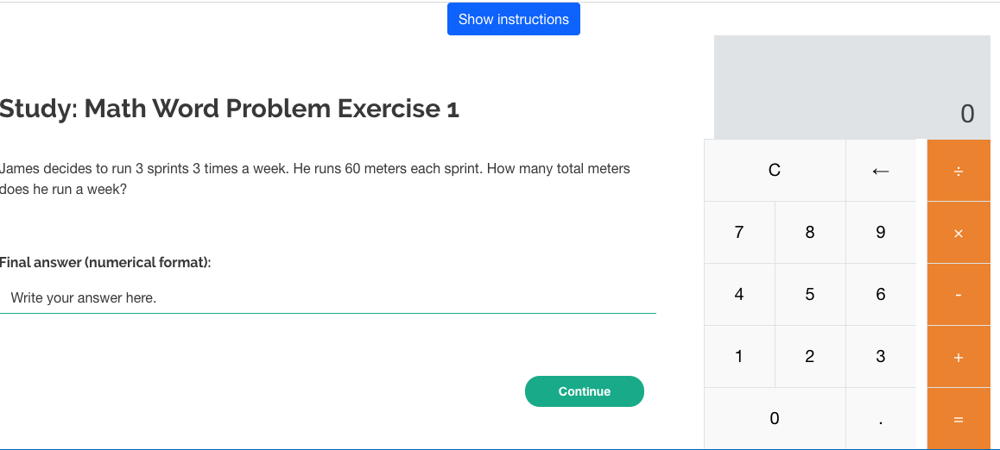
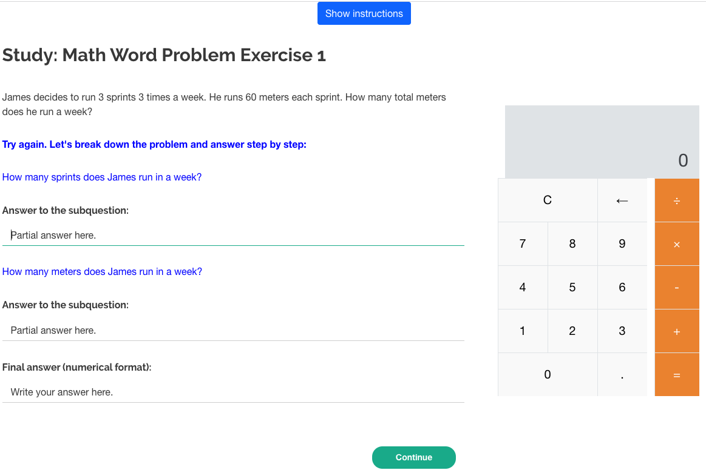

# Automatic Generation of Socratic Subquestions for Teaching Math Word Problems

This repository contains code of the paper:

### [Automatic Generation of Socratic Subquestions for Teaching Math Word Problems](https://aclanthology.org/2022.emnlp-main.277/) (Accepted at EMNLP 2022).  
#### _Kumar Shridhar*, Jakub Macina*, Mennatallah El-Assady, Tanmay Sinha, Manu Kapur and Mrinmaya Sachan_
---

We explore the ability of large language models (LMs) in generating sequential questions for guiding math word problem-solving. We propose various guided question generation schemes based on input conditioning and reinforcement learning and found that on both automatic and human quality evaluations, LMs constrained with desirable question properties generate superior questions and improve the overall performance of a math word problem solver.

All experiments are performed on [GSM8K Dataset](https://github.com/openai/grade-school-math).


## Citation
Please cite as:
```bibtex
@inproceedings{shridhar-macina-2022-socratic-generation,
    title = "Automatic Generation of Socratic Subquestions for Teaching Math Word Problems",
    author = "Shridhar, Kumar  and
      Macina, Jakub  and
      El-Assady, Mennatallah  and
      Sinha, Tanmay  and
      Kapur, Manu  and
      Sachan, Mrinmaya",
    booktitle = "Proceedings of the 2022 Conference on Empirical Methods in Natural Language Processing",
    month = dec,
    year = "2022",
    address = "Abu Dhabi, United Arab Emirates",
    publisher = "Association for Computational Linguistics",
    url = "https://aclanthology.org/2022.emnlp-main.277",
    pages = "4136--4149",
    abstract = "Socratic questioning is an educational method that allows students to discover answers to complex problems by asking them a series of thoughtful questions. Generation of didactically sound questions is challenging, requiring understanding of the reasoning process involved in the problem. We hypothesize that such questioning strategy can not only enhance the human performance, but also assist the math word problem (MWP) solvers.In this work, we explore the ability of large language models (LMs) in generating sequential questions for guiding math word problem-solving. We propose various guided question generation schemes based on input conditioning and reinforcement learning.On both automatic and human quality evaluations, we find that LMs constrained with desirable question properties generate superior questions and improve the overall performance of a math word problem solver. We conduct a preliminary user study to examine the potential value of such question generation models in the education domain. Results suggest that the difficulty level of problems plays an important role in determining whether questioning improves or hinders human performance. We discuss the future of using such questioning strategies in education.",
}

```

## Code
- Install dependencies from `requirements.txt` file - `pip install -r requirements.txt`
- Run the question generation pipeline with various environment variables (see experiments in the paper) defined in the script which modify `experiments.conf` file:
```bash
./run.sh
```

### Code structure
- `data/` contains the GSM8K Socratic dataset
- `question_generation_pipeline.py` - main python file for running the QG pipeline
- `train.py` - training the model
- `model.py` - model definition and sampling
- `dataloaders.py` - dataloaders of the GSM8K dataset
- `evaluate.py` - evaluation of the model
- `sample.py` - inference, sampling from the model
- `rewards.py` - computing different rewards for question generations
- `planning_train.py` - training the planning model

## User study
- User study contains of html for both groups with user study and post-test evaluation, qualification script for selecting participants
- See `treatment_group.html` for the user interface with generated questions as hints
- See `control_group.html` for the user interface without questions


Control group

Treatment group

<a rel="license" href="http://creativecommons.org/licenses/by/4.0/"></a><br /><span xmlns:dct="http://purl.org/dc/terms/" href="http://purl.org/dc/dcmitype/Dataset" property="dct:title" rel="dct:type">Our work</span> is licensed under a <a rel="license" href="http://creativecommons.org/licenses/by/4.0/">Creative Commons Attribution 4.0 International License</a>.
