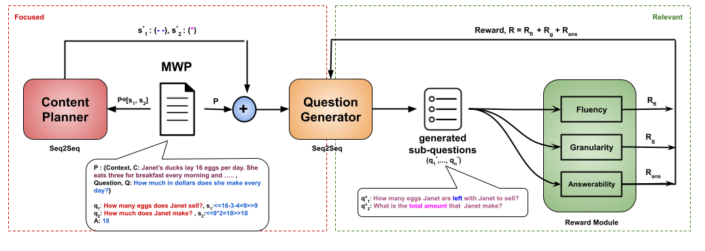

# Automatic Generation of Socratic Subquestions for Teaching Math Word Problems

This repository contains code of the paper:

[Automatic Generation of Scaffolding Questions for Learning Math]() (Accepted at EMNLP 2022).  
*Kumar Shridhar*, Jakub Macina*, Mennatallah El-Assady, Tanmay Sinha, Manu Kapur and Mrinmaya Sachan*
--

We explore the ability of large language models (LMs) in generating sequential questions for guiding math word problem-solving. We propose various guided question generation schemes based on input conditioning and reinforcement learning and found that on both automatic and human quality evaluations, LMs constrained with desirable question properties generate superior questions and improve the overall performance of a math word problem solver.

All experiments are performed on [GSM8K Dataset](https://github.com/openai/grade-school-math).

## Camera ready version of the paper and the code is coming soon!